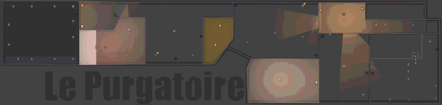

<p align="center">
<a href="#installation"></a>
<a href="#light-on-the-floor-plan"></a>
<a href="#the-full-size-editor"></a>
<a href="#selecting-lights"></a>
<a href="#the-controls"></a>
<a href="#options-this-fork-adds"></a>
<a href="#troubleshooting"></a>
<br></p>

<h1><p align="center"> Spatial Lights Card &mdash; maxi1134 fork </p></h1>

This is a fork of [Mihonarium/hass-spatial-lights-card](https://github.com/Mihonarium/hass-spatial-lights-card),
and all credit for the original card goes there.

**This README only documents what the fork adds.** Everything else &mdash; the
colour wheel, presets, effect presets, adaptive lighting, canvas elements, custom
CSS, theming, and the whole base configuration &mdash;
[is documented upstream](https://github.com/Mihonarium/hass-spatial-lights-card#readme)
and works here exactly as it does there.

I have 130-odd Zigbee devices and a good chunk of them are lights. The original
card solved the hard half of the problem: it put them on a floor plan, so you
grab a room by dragging a box round it instead of scrolling a list of names.

What I wanted on top was for the **plan itself to do the work**. If the plan is
how you find a light, the plan should also show you what that light is *doing* &mdash;
so the light lands on the floor, it mixes with the light next to it, walls stop
it, and an open door lets it through.

<p align="center">

</p>

<p align="center">
<a href="https://my.home-assistant.io/redirect/hacs_repository/?owner=maxi1134&repository=hass-spatial-lights-card&category=plugin"></a>
</p>

---

## What this fork adds

| | |
| --- | --- |
| **[Light diffusion](#light-diffusion-light_field)** | Every light paints onto one shared surface, so overlapping pools genuinely mix instead of stacking. Red over blue gives magenta, not two circles. |
| **[Walls and shadows](#walls-and-shadows)** | Draw walls on the plan and light stops at them, with exact shadows solved by ray-casting &mdash; it wraps around a wall's end precisely where geometry says it should. |
| **[Doors](#doors--walls-that-open)** | A wall can be tied to a `binary_sensor`, so it blocks light only while the door is shut. |
| **[The full-size editor](#the-full-size-editor)** | Draw walls and place lights on a near-fullscreen plan instead of a 250px preview pane. |
| **[Rotating the plan](#rotating-the-plan)** | Turn the whole layout 90/180/270&deg;: lights, zones, walls, image and emission directions together. Non-destructive &mdash; nothing you placed is rewritten. |
| **[Colour bars](#colour-bars)** | The colour wheel is replaced by four bars: a vertical brightness bar beside colour, saturation and temperature. Easier to aim than a 128px circle. |
| **[Only the bars that apply](#only-the-controls-a-light-actually-has)** | A bulb that only does white does not get a hue bar, and one that only switches gets an Off &#124; On control instead. |
| **[Lasso selection](#lasso-draw-any-shape-you-like)** | Draw a freehand outline instead of a rectangle, and hold to borrow the other shape for one drag. |
| **[Draggable controls](#overlaid-controls-that-get-out-of-the-way)** | Overlaid controls can be dragged anywhere on the plan, follow the group you select, and shrink to fit the plan rather than scrolling. |
| **[Script buttons](#script-buttons)** | Run any script, scene or service against the lights you have selected, from a button in the controls. |
| **[Max lumens](#max-lumens)** | Tell the card what a bulb actually puts out and the light on the plan matches. |
| **[Not affected by group selection](#not-affected-by-group-selection)** | Mark the UV projectors so a drag-select never sweeps them up. |
| **[Uncropped plans](#uncropped-plans)** | The canvas adopts your plan's own aspect ratio, so nothing is cropped, stretched or letterboxed at any card width. |

Plus a few smaller ones: plan-relative (`%`) glow sizes so a plan looks the same
at every card width, a configurable control-bar height, per-light
[disable-glow](#disable-glow-per-light), a
[wall colour](#wall-colour), and light labels that stay legible over projected
light.

---

## Installation

### Via HACS (Recommended)

This fork is not in the default HACS store, so HACS has to be told where to find
it. Once. After that it updates like any other card.

#### 1: Open it in HACS

<a href="https://my.home-assistant.io/redirect/hacs_repository/?owner=maxi1134&repository=hass-spatial-lights-card&category=plugin"></a>

HACS will offer to add `maxi1134/hass-spatial-lights-card` as a custom
repository. Accept it, then install the card.

#### 2: Or add it by hand, if that button does nothing for you

- HACS &rarr; the three-dot menu &rarr; **Custom repositories**
- URL: `https://github.com/maxi1134/hass-spatial-lights-card`
- Type: **Dashboard**
- Then find **Spatial Lights Card** in HACS and install it.

#### 3: Reload your browser when prompted

Voila! The card now shows up in your card picker.

> **Already running the upstream card?** Remove it in HACS first. Both
> repositories are named `hass-spatial-lights-card`, so HACS installs them to the
> same path &mdash; `/config/www/community/hass-spatial-lights-card/` &mdash; behind the same
> dashboard resource URL, and whichever updated last wins. Your dashboard YAML
> needs no changes either way: the card type is `custom:spatial-light-color-card`
> in both.

---

### Manual Installation

```bash
# Copy the file
cp hass-spatial-lights-card.js /config/www/
```

Then register it as a resource. Settings &rarr; Dashboards &rarr; (three dots) &rarr;
Resources, or in `configuration.yaml`:

```yaml
resources:
  - url: /local/hass-spatial-lights-card.js
    type: module
```

---

## Light on the floor plan

This is the part I forked the card for.

### Light Diffusion (`light_field`)

The original renderer gives each light its own element, so where two glows
overlap the topmost simply wins and the colours never mix &mdash; and each light's
wall shadow is trapped inside its own box, so a wall cannot shadow a
*neighbouring* light's spill.

`light_field` replaces all of that with one shared canvas layered over the plan.
Every light paints onto that single surface **additively**, so overlapping lights
merge like real light: a red pool crossing a blue pool is genuinely magenta and
genuinely brighter. Walls become true occluders that **cast shadows**, computed
as exact visibility polygons rather than approximated with a bitmap mask.

```yaml
light_field: true      # shorthand for {enabled: true}
```

That single line is enough. Every light diffuses its own colour across the plan,
and any walls you have configured block it.

```yaml
light_field:
  enabled: true
  over_plan: normal    # how the layer blends with the plan
  exposure: 1.0        # global brightness of the diffusion
  radius: 190          # reach for lights with no glow config of their own
  samples: 5           # soft shadows: 1 = hard edges, 3/5/9 = penumbra
  source_radius: 8     # emitter size, only used when samples > 1
  ambient: 0.15        # a wide, faint second wash
```

| Key | Default | Meaning |
|-----|---------|---------|
| `enabled` | `false` | Master switch. Off = the original per-light glow elements, unchanged |
| `over_plan` | `normal` | `normal`, `screen`, `multiply`, `plus-lighter`, `overlay`, `soft-light`, `hard-light` |
| `blend` | `lighter` | How lights accumulate with *each other*: `lighter` (additive) or `screen` |
| `exposure` | `1.0` | 0&ndash;4 multiplier on the layer's alpha |
| `radius` | `'19%'` | Reach for a light with no `glow` config. A percentage of the canvas, or a plain number for CSS px |
| `falloff` | `smooth` | Same curves as `glow.falloff` |
| `samples` | `1` | `1`, `3`, `5`, `9` &mdash; area-light samples for soft shadows |
| `source_radius` | `6` | px emitter radius; only meaningful when `samples > 1` |
| `ambient` | `0` | 0&ndash;1 second, wider, low-intensity pass |
| `ambient_reach` | `2.5` | Reach multiplier for that pass |
| `quality` | `auto` | `auto`, `low`, `medium`, `high` &mdash; backing-store resolution |
| `max_pixels` | `2600000` | Backing-store budget in device pixels |
| `show_walls` | `auto` | `auto` (only while drawing), `always` (also on the live dashboard), `never` |
| `wall_color` / `wall_width` | grey / `2` | Appearance of the drawn wall outline &mdash; see [Wall colour](#wall-colour) |

**Choosing `over_plan`.** `normal` reads correctly on any plan and is the
default. `screen` suits dark blueprints (it is a no-op over white). `multiply`
suits white plans and is the most physically literal &mdash; a white floor under a red
bulb really does look red &mdash; but it crushes a dark plan toward black.

**Your existing `glow` config still applies.** `glow` and `light_field` are not
two features: `glow` says **what each light emits** (shape, size, direction,
spread, intensity, falloff, colour) and `light_field` says **how that emission is
composited**. The editor presents them as one **Light Projection** section with a
*Renderer* choice. Switching renderer changes nothing about your `glow` config.

The only two glow keys the diffused renderer ignores are `blur` and
`edge_softness`, and the editor greys them out as *classic only*. Both existed to
fake soft edges on a hard-edged element; the field's shadow edges are real
geometry, and softening those is what `samples` / `source_radius` do. Set
`samples: 1` for crisp shadow edges.

Cost is modest: 12 lights against 30 wall segments with 5-sample soft shadows
measures ~6.5 ms for a full solve and ~1.1 ms once the visibility polygons are
cached. They are keyed on geometry only, so colour and brightness changes never
re-solve. The card falls back to the original renderer if a 2D canvas is
unavailable.

### Sizes: percent, not pixels

`glow.width`, `glow.length` and `light_field.radius` accept **either** a plain
number (CSS pixels) or a **percentage of the canvas** (`'26%'`).

Use percentages. A pixel reach covers a different share of the plan at every card
width, so the same config renders differently in the editor preview, on a phone
and on a monitor. Light positions and walls are already percentages &mdash; the reach
was the one thing left that was not. Measured, one config at three widths:

| | 460 px canvas | 990 px | 1360 px |
|---|---|---|---|
| `width: 300` (px) | 56% of the plan | 26% | 19% |
| `width: '26%'` | 22% | 22% | 22% |

```yaml
glow:
  enabled: true
  shape: round
  width: 26%     # instead of 300
  length: 26%
```

Plain numbers still mean pixels, so nothing changes until you switch. Only
`light_field.radius` defaults to a percentage, being new here with no existing
configs to preserve.

### Walls and shadows

Walls are invisible line segments or boxes that stop light from expanding &mdash;
like the physical walls they represent. Upstream has line and box forms; this
fork adds the **polyline**, which is what the wall editor writes when you trace a
room and the tidiest way to hand-author one:

```yaml
glow_walls:
  - points: [[10, 10], [90, 10], [90, 60], [10, 60]]
    closed: true          # join the last point back to the first
```

Each adjacent pair becomes a segment, so a closed polyline of four points is a
room. Doors apply to the whole run, not to one edge.

> **Seeing your walls afterwards.** Walls are invisible on a live dashboard by
> default &mdash; they are occluders, not decoration. Set `light_field.show_walls:
> always` to draw them permanently. That works even with `light_field` disabled,
> so you can always check the geometry you drew:
> ```yaml
> light_field:
>   show_walls: always
> ```

### Doors — walls that open

This is my favourite one. Give a wall an `entity` and it only blocks light in one
state, so an open door genuinely spills light into the next room:

```yaml
glow_walls:
  - { x1: 40, y1: 20, x2: 40, y2: 45, entity: binary_sensor.hallway_door }
```

A wall with no `entity` is permanent, as before.

| Key | Default | Meaning |
|-----|---------|---------|
| `entity` | &mdash; | The entity that gates this wall. Any domain. |
| `blocks_when` | `closed` | `closed` blocks while the entity reads closed/off; `open` inverts it |

**What counts as open**, per domain:

| Domain | Open when |
|---|---|
| `binary_sensor` (door, window, garage, opening) | state is `on` &mdash; a door sensor reads `on` when the door *is* open |
| `switch`, `input_boolean`, `light` | state is `on` |
| `cover` | state is `open` or `opening`, or `current_position > 0` |

So `blocks_when: closed` (the default) means the wall blocks light when the door
is shut &mdash; which is what you almost always want, and is why the default is not
simply "blocks when off".

An **unavailable, unknown or missing** entity blocks. A wall is the safe
assumption: a plan that silently springs a hole because a sensor dropped off the
network is worse than one that stays solid.

Doors work on boxes and polylines too &mdash; the entity applies to every side. And in
the wall editor, an open door is drawn as a dashed line, so you can see the
geometry without mistaking it for something solid.

The quickest way to make a door is inside the wall editor itself: **tap the wall**
and the inspector below the plan gives you *It's a door*, an entity picker, a
*blocks when* selector and the live verdict. The selected wall is highlighted in
gold, so on a plan with dozens of walls you can see exactly which one you are
editing.

### Wall colour

Under **Appearance &rarr; Wall Color** in the editor, or in YAML. It applies to both
renderers:

```yaml
light_field:
  wall_color: "#8899aa"
  wall_width: 2
```

Any CSS colour works; an empty value falls back to a built-in grey. A value the
browser cannot parse degrades to that grey rather than turning every wall black.

### Disable glow, per light

The editor's per-entity switch is **Disable glow** &mdash; an opt-out. Turn it on and
that one light never projects, whatever the card is set to; leave it off and it
follows the card's **Light Projection** setting like everything else.

```yaml
glow_overrides:
  light.floor_lamp:
    enabled: false
```

It never writes `enabled: true`, so it cannot pin a light on while projection is
off card-wide. If you *do* want one light lit while the rest of the card is dark,
that is still available in YAML &mdash; `enabled: true` on that entity's override. It
just is not something a single checkbox can say without lying about the other two
states.

---

## The full-size editor

Wall drawing and light placement happen in the same modal, and it opens at nearly
the full viewport.

The card editor gives its preview a narrow column, and tracing a floor plan or
nudging a light in a 250px-wide pane is genuinely miserable. This is the
comfortable way to do either.

Open it from the card editor, from either end:

- **Walls &rarr; Draw walls on the plan &rarr; Open editor**
- **Positions &rarr; Place lights on the plan &rarr; Open editor**

A **Walls / Lights** switch in its header moves between the two modes without
closing it. **Done** (or a second `Esc`) closes it and keeps your work; **Cancel**
closes it and puts the plan back exactly as it was when you opened the editor &mdash;
every wall drawn, moved or deleted, and every light placed, in both modes.

**Zoom in to place things precisely.** Scroll (or pinch) to zoom on the point
under the pointer, `Ctrl`/`&#8984;`-drag or middle-drag to pan, and the &minus; / % / +
buttons in the header do the same. Click the percentage to fit the plan again.
Every gesture works the same zoomed in, so a light can be nudged a fraction of a
percent rather than a whole one.

It sizes itself to your plan: at most 95% of the viewport in either direction, as
tall as will fit, and only as wide as the plan's own shape needs &mdash; so a portrait
plan gets a portrait editor rather than a narrow strip in the middle of a wide
empty one.

### Drawing walls

Typing four numbers per wall is a terrible way to lay out a floor plan, so the
editor gives you a real drawing surface. The **Walls** section shows a count, e.g.
"Walls (6)".

| Gesture | Result |
|---------|--------|
| Drag | Draw a wall. Starting on an existing corner **attaches to it exactly**, so a run joins with no gap |
| `Esc` | End the run (the next drag starts a fresh wall) |
| **`Shift`**-drag a corner | Move that corner &mdash; **every wall meeting there moves with it**, so a traced room stays closed |
| **`Shift`**-drag a wall's body | Move the whole wall |
| **Tap** a wall | Select it &mdash; the inspector below the plan turns it into a door and picks the entity |
| **Right-click** a wall (mouse only) | Remove it |
| Long-press a wall, or hover + `Delete` | Remove it |
| Hold `Alt` | Ignore snapping |
| `Ctrl`/`Cmd` + `Z` | Undo the last wall edit |

Plain dragging always **draws**; `Shift` is what modifies existing geometry. That
way, running a new wall out of a corner &mdash; the thing you do dozens of times while
tracing a plan &mdash; needs no modifier, and does not nudge the corner it attaches to.
Adjusting a corner is the occasional action, so it takes the key.

Snapping is **on** while drawing: endpoint-to-endpoint first, then 45&deg; angles, then
the grid. That is deliberately the opposite polarity to dragging lights, where
`Alt` *enables* snap. An unclosed corner is invisible while you draw it and
extremely obvious later, when light leaks through the gap.

Walls you draw are written back to `glow_walls` as ordinary line segments, so they
stay editable as YAML.

### Placing lights

The same editor places lights: **Positions &rarr; Open editor**, or switch to **Lights**
in its header. Drag a light to move it, tap one to see which entity it is, hold
`Alt` to ignore the grid. Walls stay visible as reference, because placing a light
means placing it relative to a room.

Selecting a light in the editor's **Entities** list also highlights it on the plan
in gold. On a plan with twenty lights, a list row tells you nothing about where it
actually is.

---

## Rotating the plan

**Positions &rarr; Rotate plan** turns the whole layout a quarter at a time, so you can
try your floor plan the other way round without re-placing a single thing. Lights,
zones, walls, the plan image and the direction each light throws its light all
turn together.

It is a **view** setting, not a rewrite. Everything you placed &mdash; `positions`,
`canvas_elements`, `glow_walls`, `aspect_ratio` &mdash; stays exactly as you authored it,
and the card applies the turn when it paints. Going back to 0&deg; restores your layout
precisely, and no arithmetic slip can scramble work you placed by hand.

```yaml
plan_rotation: 90     # 0 | 90 | 180 | 270, clockwise. Default 0.
```

Two things change shape on a quarter turn, unavoidably:

- **The card.** A wide plan becomes a tall one. In a fixed-width dashboard column a
  2:1 plan gets roughly four times taller, and the editor preview will need
  scrolling &mdash; the full-size editor is the comfortable way to work while rotated.
- **Nothing else.** Percent glow sizes are rescaled so a light still covers the
  same part of the room; plain pixel sizes are left alone, because a pixel is a
  pixel.

The turn needs a ratio to turn, and your plan image supplies one automatically. If
you have no background image (or `auto_aspect: false`), set `aspect_ratio` to the
plan's unrotated `W:H` and every orientation lines up. The card logs a warning
naming this if it is missing.

Icons keep their own upright orientation &mdash; `icon_rotation` is not touched, the same
way map labels stay level when you turn a map.

---

## The controls

### Colour bars

The colour wheel is gone. In its place are four bars in an L: brightness stands
upright on the left, as tall as the other three together, with colour, saturation
and temperature stacked to its right.

1. **Brightness** &mdash; the upright bar on the left. Drag **up for brighter**, down
   for dimmer, the way every physical dimmer in the world works. It is filled with
   the colour the lights are showing right now, *at* their current brightness:
   almost black at the bottom of the range, full colour at the top. It goes down
   to 1% but never to 0, so it dims a light without switching it off. The *swatch*
   stops darkening at 25%, so even a light dimmed right down still shows you which
   colour is set, while the bar keeps reporting the real level.
2. **Colour** &mdash; the full spectrum. Picking a hue here sets it at **full
   saturation**; use the bar below to walk it back toward white.
3. **Saturation** &mdash; pure hue on the left, white on the right. It sits directly
   under the colour bar because it modifies what that bar picked, and it stays
   where you put it until you pick a new colour.
4. **Temperature** &mdash; warm on the left, cool on the right.

Brightness is upright because it is the one bar that is not a colour choice: the
other three pick *what* the light emits, brightness picks *how much*.

- **Tap/click** anywhere along a bar to jump straight to that value.
- **Drag** to sweep; the lights follow live, throttled to about seven updates a
  second so a long drag does not flood your connection.
- **Arrow keys** step whichever bar has focus.
- **Height** is yours: `color_bar_height` (px, default 34), or the **Control Bar
  Height** slider in the editor's **Display** section.
- On mobile, starting a vertical scroll on a bar releases it so the page can
  scroll, rather than the bar swallowing your gesture.

There is no magnifier or full-screen picker any more either &mdash; a bar running the
full width of the controls has nothing left to aim at.

### Only the controls a light actually has

There is no point showing a hue bar to a bulb that only does white. The picker
shows the bars your selection can actually obey, and nothing else.

| The light supports | You get |
|---|---|
| Brightness only | one **brightness** bar |
| Brightness + temperature | **brightness**, **temperature** |
| Colour (no temperature) | **brightness**, **hue**, **saturation** |
| Colour + temperature | all four |
| On/off only | an **Off &#124; On** control instead &mdash; see below |

The **brightness bar previews what the light emits**: its colour, at its current
level. A bulb with no colour of its own previews as white, so a plain dimmable
light reads as grey at half brightness rather than borrowing the colour of
whatever you had selected before it.

**With fewer than three bars, they all lie flat.** The upright brightness bar only
exists to stand alongside a column of three; with one or two there is no column to
match, so everything goes horizontal and full width.

Capabilities are a **union across the selection**, so grouping a plain dimmable
bulb with a colour one gives the whole group all four bars.

Colour and temperature **presets** stay visible but dimmed when they have no
target, rather than vanishing. A presets row that changed length would move
everything under your thumb every time you selected something different.

### Switch-only lights

Select a light that can only be switched &mdash; no brightness, no colour, no
temperature &mdash; and the colour bars are replaced by a single **Off | On** control
rather than four greyed-out ones.

- All selected lights **on**, or all **off** &rarr; that half is filled in.
- They **disagree** &rarr; neither half is filled, and a line underneath reads
  `2 on, 1 off`. Each button is a destination, so one press settles the whole
  group either way.

The panel is exactly the same height in all three states, so nothing moves under
your thumb while the lights catch up.

**Group it with a capable light and the bars come back**, for the whole group.

Scripts, scenes and effect buttons stay put throughout. `show_power_button`
controls only the small round toggle in the presets row &mdash; a switch-only selection
always gets the Off | On control, because otherwise it would have no control at
all.

### Overlaid controls that get out of the way

With `controls_below: false` the controls float over the plan. Upstream shows and
hides them; this fork makes them behave.

- **They fit the plan.** The picker is never taller than the floor plan it floats
  over, and rather than scrolling inside it, it trims its own padding first and
  then its bar height until it fits. A plan with room is left untouched. On a very
  short, wide plan (3:1 or flatter) even the smallest bars will not fit and it
  scrolls &mdash; `controls_below: true` is the better shape there.
- **They follow the selection.** Left alone they sit just clear of the lights you
  have selected, on whichever side has room, rather than parking at one end of the
  plan.
- **Drag them** by the grip at the top to put them wherever suits your plan. The
  position holds for the group you are working on &mdash; through state changes, resizes,
  a deselect and a reselect &mdash; and is remembered per card in your browser, so it
  survives a reload.
- **Selecting a different group puts them back beside it.** A drag is a nudge for
  the lights in hand, not a permanent pin, so you never have to undo it before
  moving on to another room.
- **Keyboard**: focus the grip and use the arrow keys to nudge it (hold Shift for
  bigger steps), or Escape to go back to automatic placement.
- **Double-click (or double-tap) the grip** to go back to automatic placement
  straight away, without changing the selection.
- They **compress** on a narrow card, shrinking their padding and wrapping the
  presets rather than spilling past the plan.

### Script buttons

Buttons in the controls that run a script against the lights you have selected.
This is the escape hatch for anything the card does not do natively.

```yaml
script_buttons:
  - script.flash_lights            # shorthand: icon and label are derived
  - script: script.wind_down
    name: Wind down
    icon: mdi:weather-night
  - script: scene.turn_on          # scenes are activated through scene.turn_on
    name: Movie
    icon: mdi:movie
    pass_entities: false           # do not send the selection...
    data:
      entity_id: scene.movie_night # ...send the scene instead
```

The script receives the entities as `entity_id`, so a script like this one gets
exactly the lights you had selected:

```yaml
flash_lights:
  fields:
    entity_id:
      selector: {entity: {multiple: true}}
  sequence:
    - service: light.turn_on
      target: {entity_id: "{{ entity_id }}" }
      data: {flash: short}
```

| key | default | meaning |
| --- | --- | --- |
| `script` | required | Any callable `domain.service`. Scripts can be named directly; scenes and automations go through `scene.turn_on` / `automation.trigger` with the entity in `data`. `service:` works as an alias. |
| `name` | from the service id | Button label and tooltip. |
| `icon` | `mdi:script-text-play` | Any mdi icon. |
| `target_key` | `entity_id` | The variable name the entities arrive under. |
| `data` | none | Fixed arguments merged into the call. |
| `pass_entities` | `true` | Set `false` to send no entities at all. |

With nothing selected the button falls back to `default_entity`, and failing that
to every entity on the card. Unavailable entities are dropped before the call, and
if nothing is left the button does nothing rather than erroring at you.

They can also be managed in the visual editor's **Presets** section, with an
entity picker for your `script.*` and `scene.*` entities.

---

## Selecting lights

### Lasso: draw any shape you like

A rectangle is the wrong shape for most rooms. An L-shaped living room, a run of
lights down a hallway, everything except the one lamp in the middle &mdash; none of
those is a box.

All three selection settings live in the editor under **Interaction**, so none of
this needs YAML unless you prefer it.

```yaml
selection_mode: lasso   # 'box' (default) or 'lasso'
```

Everything inside the outline gets selected, and **inside means inside** &mdash; draw a
U around a room and a light sitting in the notch is left out, where a rectangle
would have grabbed it.

**Cross your own line as much as you like.** Doubling back into a region you have
already circled does not punch a hole in it &mdash; the outline is filled by its
outermost limits, so a light in the middle stays selected no matter how many times
the path loops over itself. Genuine notches, like the open side of that U, are
still notches.

The line glows, and the region it encloses washes warm amber as you draw, so you
can see what you are about to get before you let go.

Nothing else about selecting changes: same drag on empty canvas, same Shift/Ctrl
to add to what you already have, same live update as you draw. The shape is not
saved anywhere &mdash; it is a gesture, not a zone.

### Hold to borrow the other shape

Most of the time one shape is the right one, but not always &mdash; a lasso is overkill
for grabbing two lamps side by side, and a rectangle cannot follow an L-shaped
room.

```yaml
selection_swap_hold: 450   # milliseconds. 0 (the default) turns it off.
```

Press on empty canvas, **hold still** that long, then drag: that one drag uses the
other shape. On lasso you get a rectangle, on rectangle you get a lasso. Let go and
you are back to whatever you configured.

You get a double buzz when it takes, and the band on screen changes to the shape
you are about to draw, so you never have to guess whether the hold registered.

**It is off by default**, deliberately. Press, pause, drag is a gesture a hand
makes without meaning to, and nobody who has not asked for this should discover it
by accident. Moving before the hold completes just gives you the normal shape.
Values are clamped to 150&ndash;5000 ms.

In the editor it is **Interaction &rarr; Hold to Swap Shape**; leave the field empty to
keep it off.

### The colour of the band

```yaml
selection_color: [80, 220, 255]   # or "#50dcff", or "rgb(80, 220, 255)"
```

The whole band follows it &mdash; the fill, the halo and the glow &mdash; and the bright core
of the line is derived from it, so it keeps looking luminous whatever hue you
choose. It colours the plain rectangle marquee too, since it names the band and not
one of its two shapes. Leave it out and you get the gold.

RGB rather than any CSS colour, because the band needs the same hue at four
different opacities and the components have to be separable. An unparseable value
falls back to the default rather than breaking the band.

The editor has a colour picker for it under **Interaction &rarr; Selection Band
Color**, which writes the hex form. A `[r, g, b]` triplet set in YAML shows up
there correctly too.

### Not affected by group selection

I have UV projectors in most rooms. They share the floor plan with ordinary lights,
and I very much do not want them swept up every time I drag a box around the living
room.

Open a light in the card editor's entity list and turn on **Not affected by group
selection**. From then on, that light:

- is **skipped by drag-select** and by select-all;
- is **left out of effect presets and script buttons** fired with nothing selected
  (which otherwise target every light on the plan).

It stays completely controllable, as long as you aim at it directly:

- **tap it** &mdash; selects just that light, replacing the selection;
- **long-press it** &mdash; adds it to the group you already have;
- **Shift/Ctrl/Cmd-click** or **Enter** &mdash; toggles its membership.

Naming it explicitly always wins too. Set it as `default_entity`, or list it in an
effect preset's own lights, and it gets targeted normally.

```yaml
group_exempt_overrides:
  light.uv_living: true
  light.uv_bedroom: true
```

### Long-press builds a group, on touch

A phone has no Shift key, so the long press does two jobs and the selection decides
which. With **nothing selected** it opens more-info, as upstream. While lights
**are** selected it **adds** the light you pressed to the group.

It only ever adds. Holding a light that is already selected changes nothing, so a
press you are not sure registered is always safe to repeat. To remove one,
Shift/Ctrl-click it on a desktop or press Enter with it focused; to drop the whole
group, tap empty canvas or hit Escape.

To reach more-info while a selection is live, clear the selection first &mdash; or just
right-click, which opens more-info on a desktop no matter what is selected.

---

## Lights on the plan

### Max lumens

Bulbs tell you what they put out. Tell the card, and the light it paints on your
plan matches: open a light in the editor's entity list and set **Max lumens**.

The default is **800**, which is what a standard smart bulb emits, so a card that
never sets one looks exactly as it did before. There is no upper limit &mdash;
floodlights are fine.

A brighter fixture gets **both** a stronger pool and a slightly wider one, and a
dimmer one the reverse. The two are balanced so the plan receives about as much
light as the bulb actually emits: doubling the lumens roughly doubles the light on
the plan rather than quadrupling it. Over a 16&times; range of bulbs, the pool's radius
moves about 2.5&times;.

That balance holds up to roughly **1600 lm** at the default glow intensity, which is
where the pool hits full opacity. Anything brighter keeps widening but stops getting
brighter &mdash; there is simply no headroom left to give it.

It combines with the light's current brightness rather than replacing it, so a
dimmed 3000 lm bulb still outshines a dimmed 800 lm one. It also applies with
`scale_with_brightness` off, since lumens are a property of the fixture and not of
its current level.

```yaml
lumens_overrides:
  light.kitchen_ceiling: 1600
  light.bedside_lamp: 450
```

### Uncropped plans

```yaml
background_image:
  url: "/local/floorplan.png"
```

That is the entire configuration for a floor plan. The canvas measures the image
and adopts its aspect ratio, so the plan fills the canvas **exactly** &mdash; never
cropped, never letterboxed, never squashed &mdash; and a light placed over the sofa on
your desktop is still over the sofa on your phone.

Three keys are new here:

| Key | Default | Meaning |
|-----|---------|---------|
| `auto_aspect` | `true` | Canvas takes the image's intrinsic aspect ratio (overridden only by `aspect_ratio`) |
| `fit` | `contain` | `contain`, `cover` (crops), `stretch` (or `fill`, distorts), `native` (or `auto`, the image's own pixel size) |
| `rendering` | `auto` | CSS `image-rendering` &mdash; use `pixelated` or `crisp-edges` for hand-drawn or low-resolution plans |

Auto-aspect steps aside the moment you pin the geometry yourself:

```yaml
background_image:
  url: "/local/floorplan.png"
  auto_aspect: false
canvas_height: 520
```

`canvas_height` does **not** override auto-aspect. It is the fallback for when
there is no plan image, or the image fails to load.

> **Coming from the original card:** if you previously matched `aspect_ratio` to
> your image by hand, nothing changes. If you did not, your canvas now takes the
> plan's ratio rather than a fixed height, so the whole plan becomes visible and
> your light positions land on the plan features their percentages always referred
> to &mdash; under the old `cover` default the plan was cropped, so they didn't. Set
> `auto_aspect: false` and `fit: cover` to keep the previous look exactly.

---

## Options this fork adds

Everything else is upstream's and
[documented there](https://github.com/Mihonarium/hass-spatial-lights-card#readme).

| Option | Type | Default | Description |
|--------|------|---------|-------------|
| `light_field` | map/bool | `{enabled: false}` | Shared-canvas light diffusion: colours merge additively and walls cast real shadows. See [Light Diffusion](#light-diffusion-light_field). |
| `plan_rotation` | number | `0` | Quarter turn of the whole layout: `0`, `90`, `180` or `270`, clockwise. A view setting &mdash; your coordinates are never rewritten. See [Rotating the Plan](#rotating-the-plan). |
| `color_bar_height` | number | `34` | Thickness of the four control bars, in px &mdash; the height of the three horizontal ones and the width of the brightness bar. Clamped to 12&ndash;120. |
| `script_buttons` | list | `[]` | Buttons in the controls that run a script, scene or service against the selection. See [Script buttons](#script-buttons). |
| `group_exempt_overrides` | map | `{}` | Per-entity `true` to mark a light **not affected by group selection**. See [that section](#not-affected-by-group-selection). |
| `lumens_overrides` | map | `{}` | Per-entity maximum output in lumens (default `800`). A brighter bulb throws a stronger and slightly wider pool of light on the plan. See [Max lumens](#max-lumens). |
| `selection_mode` | string | `"box"` | How a drag on empty canvas selects: `box` is the rubber-band rectangle, `lasso` draws a freehand outline. See [Lasso](#lasso-draw-any-shape-you-like). |
| `selection_color` | list/string | `null` | Colour of the selection band, as `[r, g, b]` (a `"#rrggbb"` or `"rgb(r,g,b)"` string works too). Applies to both shapes. |
| `selection_swap_hold` | number | `0` | Hold still this many milliseconds on empty canvas before dragging, and that one drag uses the *other* shape. `0` disables it; anything else is clamped to 150&ndash;5000. |

And these extend options the original card already had:

| Option | What this fork adds |
|---|---|
| `background_image` | `auto_aspect`, `fit` and `rendering` &mdash; see [Uncropped plans](#uncropped-plans) |
| `glow.width` / `glow.length` | accept a `'NN%'` percentage of the canvas, not just pixels &mdash; see [Sizes](#sizes-percent-not-pixels) |
| `glow_walls` | the `points` polyline form, and `entity` / `blocks_when` for [doors](#doors--walls-that-open) |
| `glow_overrides` | **Disable glow** as a per-light opt-out &mdash; see [that section](#disable-glow-per-light) |

---

## Troubleshooting

Problems with the base card belong
[upstream](https://github.com/Mihonarium/hass-spatial-lights-card/issues/new).
These two are about things this fork added.

### Labels hard to read over the light?

They should not be &mdash; light is always painted *behind* the names and icons, and
labels carry an opaque backing so nothing can bleed through.

If you have deliberately set a translucent `theme.label_background`, that choice is
honoured as-is, so the light **will** show through it. Remove it, or give it a solid
colour, to get the opaque backing back.

### Floor plan looks blurry or soft?

Almost always, the source image is being **upscaled**. The card is as wide as its
dashboard column, and on a 2x display a full-width card renders a plan at
2000&ndash;3000 device pixels across. A 1000px-wide source has to be stretched to fill
that, and no CSS setting can invent detail that was never there.

Open the browser console &mdash; the card measures your plan and tells you exactly what
it needs:

```
[spatial-lights-card] Plan image is being upscaled 4.1x and will look soft:
source is 400x250, but this card renders it at 1640px wide
(820 CSS px x 2 device pixel ratio). Use a source at least 1640px wide...
```

What to do, in order of how much it helps:

#### 1: Use a bigger source

Export the plan at the width the warning names, or wider. An SVG floor plan is
better still &mdash; it is resolution-independent and stays sharp at any card width.

#### 2: Check what Home Assistant is actually serving

A URL like `/api/image/serve/<id>/512x512` is a *downscaled variant*. HA generates
several sizes on upload, and that path pins you to a small one. Put the
full-resolution file in `config/www/` and reference it as `/local/plan.png` instead.

#### 3: For line art, turn off smoothing

```yaml
background_image:
  url: /local/plan.png
  rendering: crisp-edges   # or: pixelated
```

This keeps edges hard rather than interpolated. It sharpens line drawings and hurts
photographs, which is why it is not the default.

#### 4: Make the card narrower

Fewer grid columns means less upscaling needed.

### Which build am I running?

The card prints its version to the browser console on load, e.g.
`v1.48.0 (fork-maxi1134)`. If something looks like it did before an update, check
that first &mdash; browsers are stubborn about cached JavaScript.

### Something else?

- [Open an issue on this fork](https://github.com/maxi1134/hass-spatial-lights-card/issues/new)
  for anything on this page.
- [Open one upstream](https://github.com/Mihonarium/hass-spatial-lights-card/issues/new)
  if it reproduces on the original card too.
